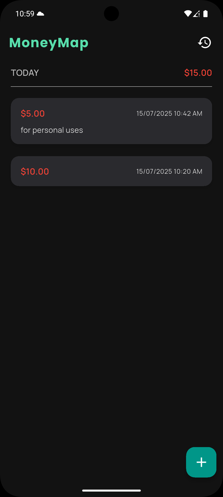
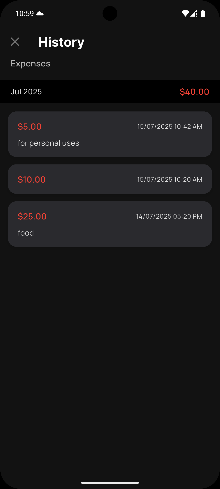
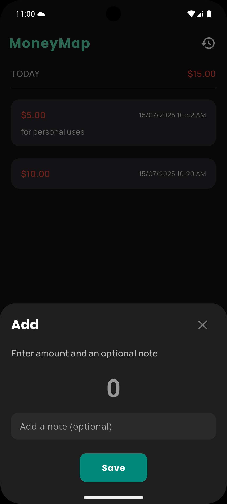

#MoneyMap

MoneyMap is a simple, lightweight expense tracking app built with Flutter. It helps you manage your personal finances by allowing you to log daily expenses, view them grouped by day or month, and see total spending trends — all stored locally for privacy and offline access.

---

## Features

- Add and manage daily expenses
- Group expenses by **month** or **day**
- See total monthly and daily spending
- Custom currency symbol support (via SharedPreferences)
- Local data persistence using Hive
- Minimal UI, fast performance, and smooth navigation

---

## Tech Stack

- **Flutter** – UI toolkit
- **Hive** – Lightweight & fast NoSQL local database
- **SharedPreferences** – For storing currency preferences
- **Google Fonts** – Beautiful typography
- **Date Formatting** – `intl` package for grouping and formatting

---

---

## Screenshots

### Home


### History


### Add Expense


## Getting Started

1. **Clone the repo:**

   ```bash
   git clone https://github.com/iampranavk/moneymap.git
   cd moneymap

2. **Install dependencies:**

   ```bash
   flutter pub get

3. **Generate Hive adapters (if needed):**

   ```bash
   flutter packages pub run build_runner build

4. **Run the app:**

   ```bash
   flutter run
